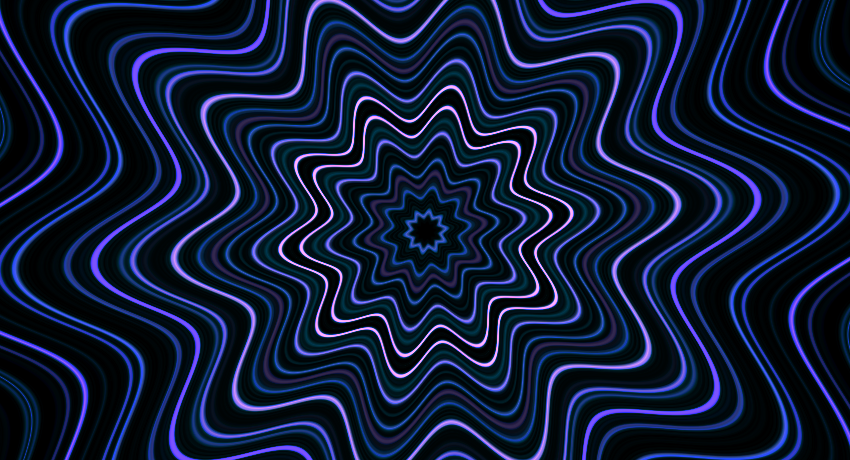
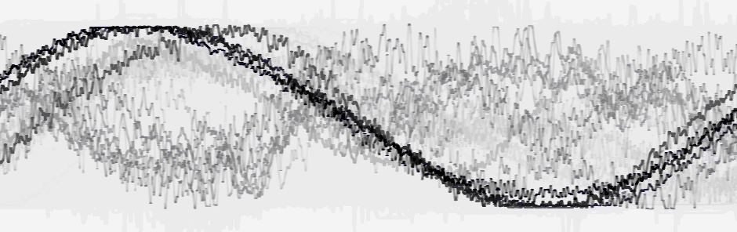

Welcome to the project page for my music visualizer :)

Here is a comparison between what my app looks like and what other music
visualizers might look like.


Currently the app can visualize constant tone sounds very well. However, when the app visualizes complicated sounds the presented waveform looks quite chaotic.

```
git clone --recursive https://github.com/xdaimon/music_visualizer.git
cd music_visualizer/
mkdir build
cd build
cmake ..
make -j4
./main
```

Depends on opengl >= 3.3, and pulseaudio.

Uses code from the following repositories<br>
<a href="https://github.com/linkotec/ffts">ffts (linkotec fork)</a>
	fast fft library<br>
<a href="https://github.com/karlstav/cava">cava</a>
	pulseaudio setup code<br>
<a href="https://github.com/kritzikratzi/Oscilloscope">Oscilloscope</a>
	shader code for drawing smooth lines<br>

Here is a youtube video of the app displaying a waveform.<br>
<a href="https://youtu.be/yxGM7H1RFRA">https://youtu.be/yxGM7H1RFRA</a>






