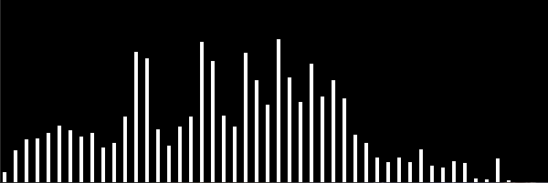
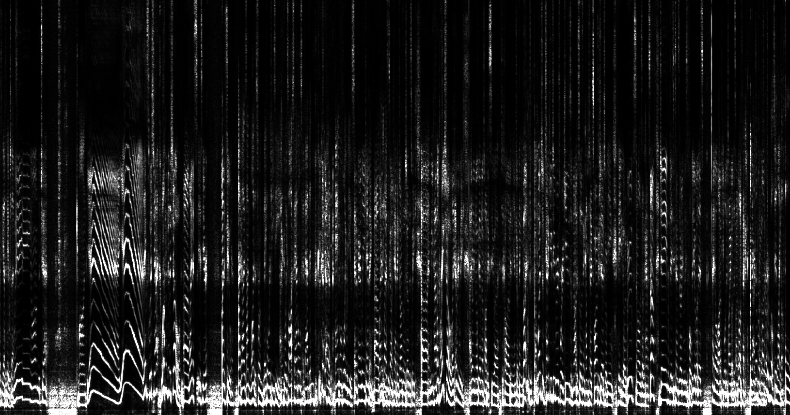
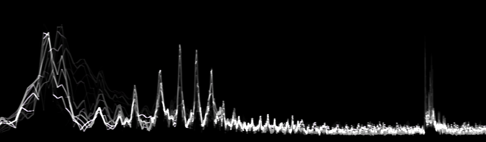

# About
Welcome to the project page for my music visualizer :)

Here is a comparison between what my app looks like and what other music
visualizers might look like when visualizing the same sound.


# Examples

  
  
  

# Usage

The user writes a .frag file that renders to a window sized quad. If the user wants multipass buffers, then multiple .frag files should be written. When a frag file is saved the app automatically reloads the changes. If the frag file compiles correctly, then the changes are presented to the user otherwise the app ignores the changes.

The name of a buffer is the file name of the frag file without the .frag extension. A buffer's output is available in all buffers as i{Filename w/o extension}. So if the files A.frag and B.frag exist, then buffer B can access the contents of buffer A by doing texture(iA, pos);.

Every shader must contain an image.frag file, just like shadertoy.

Buffers are rendered in alphabetical order and image.frag is always rendered last. If two buffers have the same name but different case, such as A.frag and a.frag, then the render order is unspecified. Do not use non ascii characters in file names ( I use tolower in the code to alphabetize the buffer file list ).

Code for a shader should be located in a folder named shaders that is in the same directory as the executable. Subdirectories of shaders/ can also contain code but that code will not be considered a part of the currently rendered shader.

A shadertoy like shader might have the following folder layout

	shader_viewer.exe
	shaders/
		image.frag
		buffA.frag
		buffB.frag

See [here](/docs/advanced.md) for details on how to configure the rendering process ( clear colors, render size, render order, render same buffer multiple times, geometry shaders, audio system toggle ).

Here is a list of uniforms available in all buffers
```
vec2 iMouse;
bool iMouseDown;     // whether left mouse button is down, in range [0, iRes]
vec2 iMouseDownPos;  // position of mouse when left mouse button was pressed down
vec2 iRes;           // resolution of window
vec2 iBuffRes;       // resolution of currently rendering buffer
float iTime;
int iFrame;
float iNumGeomIters; // how many times the geometry shader executed, useful for advanced mode rendering
sampler1D iSoundR;   // audio data, each element is in the range [-1, 1]
sampler1D iSoundL;
sampler1D iFreqR;    // each element is >= zero for frequency data, you many need to scale this in shader
sampler1D iFreqL;

// Samplers for your buffers, for example
sampler2D iMyBuff;

// Constant uniforms specified in shader.json, for example
uniform vec4 color_set_by_script;
```
# Building

First get the sources:
```
git clone --recursive https://github.com/xdaimon/music_visualizer.git
```
Then to build on Ubuntu with gcc version >= 5.5:
```
sudo apt install cmake libglfw3-dev libglew-dev libpulse-dev
cd music_visualizer
mkdir build
mkdir build_result
cd build
cmake ..
&& make -j4
&& mv main ../build_result/music_visualizer
&& cp -r ../src/shaders ../build_result/shaders
```
and on Windows 10 with Visual Studio 2017:
```
build the x64 Release configuration
```

# Contact

Feel free to use the issues page as a general communication channel.

You can also message me on reddit at /u/xdaimon

# Thanks To

<a href="https://github.com/linkotec/ffts">ffts</a>
	Fast fft library<br>
<a href="https://github.com/karlstav/cava">cava</a>
	Pulseaudio setup code<br>
<a href="https://github.com/kritzikratzi/Oscilloscope">Oscilloscope</a>
	Shader code for drawing smooth lines<br>
<a href="https://github.com/shadowndacorner/SimpleFileWatcher">SimpleFileWatcher</a>
	Asyncronous recursive file watcher<br>
<a href="https://github.com/rapidjson/rapidjson">RapidJson</a>
	Fast json file reader<br>
<a href="https://github.com/catchorg/Catch2">Catch2</a>
	Convenient testing framework<br>
